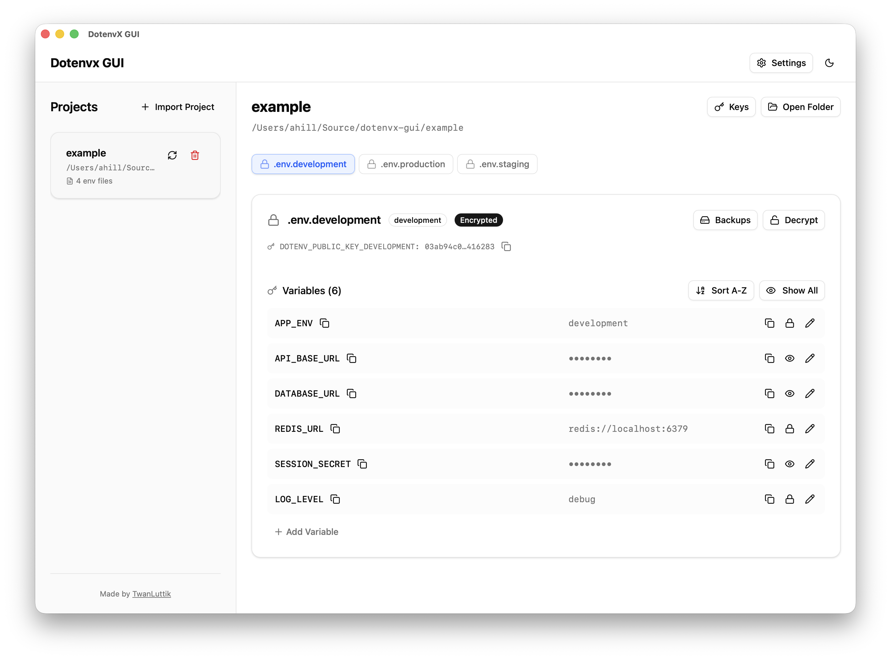

# dotenvx GUI

A cross-platform desktop app for managing and encrypting `.env` files with [dotenvx](https://dotenvx.com/). Built with [Tauri](https://tauri.app/), [React](https://react.dev/), and [TypeScript](https://www.typescriptlang.org/).



## Features

- 🔐 **dotenvx encryption** - Encrypt variables individually; view and copy decrypted values in memory without rewriting the file
- 🔑 **Key management** - `.env.keys` dialog with masked private keys, key rotation, and git safety warnings
- ⏱️ **Auto re-mask** - Revealed values re-mask after 60 seconds; copied values clear from the clipboard
- 📝 **Inline editing** - Add and edit variables directly, encrypted or plaintext
- 🔄 **File watching** - Picks up external changes to `.env` files and `.env.keys`
- 🖥️ **Cross-platform** - macOS, Windows, and Linux, built with Tauri

## Installation

### From Releases

Download the latest release for your platform:

- **macOS**: `.dmg` file (Intel or Apple Silicon)
- **Windows**: `.exe` installer
- **Linux**: `.AppImage` file

### From Source

#### Prerequisites

- [Node.js](https://nodejs.org/) 20.x or later
- [Rust](https://www.rust-lang.org/) (latest stable)
- [Bun](https://bun.sh/) package manager

#### Build Steps

```bash
# Clone the repository
git clone https://github.com/adamghill/dotenvx-gui.git
cd dotenvx-gui

# Install dependencies
bun install

# Run in development mode
bun run dev

# Build for your platform
bun run tauri build
```

## Development

### Project Structure

```
dotenvx-gui/
├── src/                 # React frontend source
├── src-tauri/          # Tauri backend (Rust)
├── public/             # Static assets
└── package.json        # Node.js dependencies
```

### Available Scripts

- `bun run dev` - Start development server
- `bun run build` - Build frontend assets
- `bun run tauri build` - Build desktop application
- `bun run clean-target` - Clean build artifacts

### Recommended IDE Setup

- [VS Code](https://code.visualstudio.com/) + [Tauri](https://marketplace.visualstudio.com/items?itemName=tauri-apps.tauri-vscode) + [rust-analyzer](https://marketplace.visualstudio.com/items?itemName=rust-lang.rust-analyzer)

## Contributing

Contributions are welcome! Please feel free to submit a Pull Request.

1. Fork the repository
2. Create your feature branch (`git checkout -b feature/AmazingFeature`)
3. Commit your changes (`git commit -m 'Add some AmazingFeature'`)
4. Push to the branch (`git push origin feature/AmazingFeature`)
5. Open a Pull Request

## License

This project is licensed under the MIT License - see the LICENSE file for details.

## Support

For issues, questions, or suggestions, please open an [issue](https://github.com/adamghill/dotenvx-gui/issues) on GitHub.
